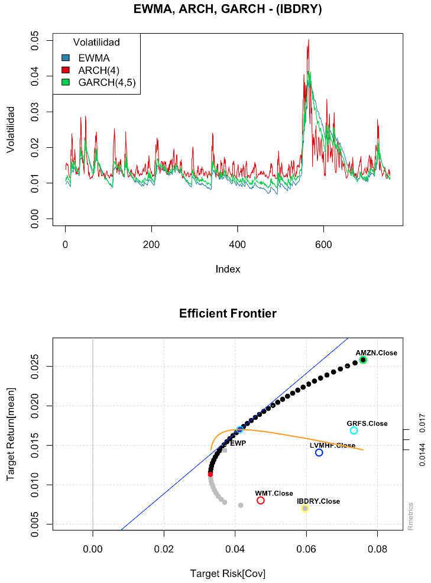

### Entregables de Estadística Actuarial y Estadística Financiera

Notebooks y entregables de proyecto de las tareas de laboratorio realizadas en la asignatura **Métodos Estadísticos para Finanzas y Seguros** del *Grado en Ciencia e Ingeniería de Datos*, en el semestre de Invierno de 2020.




#### Contenidos

```
.
├── Practica\ 1
│   ├── Practica_1.Rmd
│   ├── Practica_1.html
│   ├── autos2021.csv
│   └── based21.csv
├── Practica\ 2
│   ├── PASEM2010.csv
│   ├── Practica_2.Rmd
│   └── Practica_2.html
├── Practica\ 3
│   ├── Practica_3.Rmd
│   └── Practica_3.html
├── Practica\ 4
│   ├── Practica_4.Rmd
│   └── Practica_4.html
├── README.md
└── images
    └── img.png
```